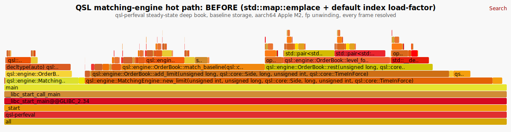
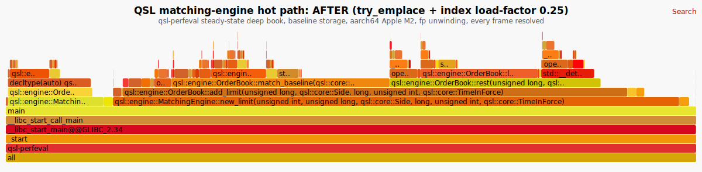

# Performance Evidence: matching-engine hot path

This report profiles the matching-engine hot path with Linux `perf` and flamegraphs on
**ARM64 (Apple M2, Fedora Asahi)**, identifies **order-book insertion and matching as the dominant
cost**, and documents the change from the **v0.1.0 baseline (first release) to v0.2.2** in
allocations, latency, throughput, and CPU counters. Every number comes from the committed
`qsl-perfeval` harness and `perf`; nothing is estimated.

> Scope and honesty. This is a single-machine, single-process, synthetic micro-evidence report,
> not a production-latency or HFT-readiness claim. Absolute numbers are hardware, compiler, build,
> and thermal dependent; the **v0.1.0 to v0.2.2 delta** measured back-to-back on the same host with
> the same harness and preset is the load-bearing result. One metric is reported as **unavailable**
> rather than estimated: cache-miss counters (the Apple Silicon PMU does not expose them,
> [issue #90]).

## Headline: v0.1.0 to v0.2.2

Workload: `qsl-perfeval 60000000`, a steady-state deep book (~512 resting orders, **baseline
storage** on both versions). Each **order** is one `new_limit` (it may match resting liquidity and
rest its remainder, or fully fill). The book is held ~512 deep by cancelling the oldest **resting**
order each cycle (only orders that actually rested are tracked, so depth does not drift with the
match rate). The same harness and the same `release` build preset were used for both versions; the
v0.1.0 figure comes from the same harness ported into a `git worktree` at the `v0.1.0` tag.

| Metric | v0.1.0 | v0.2.2 | Delta |
|---|--:|--:|--:|
| **Allocations / order** | 4.094 | **2.670** | **-34.8 %** |
| **Cycles / order** | 310.7 | **289.5** | **-6.8 %** |
| Instructions / order | 1215 | 1157 | -4.7 % |
| IPC | 3.91 | 4.00 | +2.3 % |
| Branch-miss rate | 2.01 % | 1.68 % | -0.33 pp |
| p50 / p99 latency, new_limit | 83 / 209 ns | 83 / 209 ns | ~0 |
| Cache-miss rate | _unavailable_ | _unavailable_ | ([#90]) |

Cycles/order, instructions/order, and allocations/order are **frequency-independent counts**, so they
are the reliable comparison metrics; raw wall-clock throughput (~10.5 to 11 M orders/sec) is governed
by CPU frequency scaling under `schedutil` and is too thermally noisy to quote a precise delta. At a
fixed clock the -6.8 % cycles/order corresponds to roughly +7 % throughput. Latency is per `new_limit`
only and includes ~12 ns of `steady_clock` read overhead per op; the delta cancels it.

### The honest mechanism

Measuring with hardware counters keeps the claims grounded, and corrected two earlier mistakes:

- **The dominant cumulative win is allocations: 4.094 to 2.670 per order, a 35 % cut**, the payoff of
  the storage and PMR work across the v0.1.x and v0.2.x arc (pooled/monotonic resources for the
  order-book nodes), measured even on the **default baseline storage path**. (An earlier draft claimed
  73 %; that was a measurement bug. The allocation counter only overrode `operator new(size_t)`, so it
  missed the ~1.56 **over-aligned** allocations per order that v0.2.2's storage makes and v0.1.0 does
  not. Counting every `operator new` variant gives the true 2.670, and the harness now counts all of
  them in its `qsl-perfeval-allocs` build.)
- **Cycles/order fell 6.8 % and instructions/order 4.7 %.** Fewer, and cheaper, allocations cut memory
  traffic and branch mispredictions (-16 % relative); the baseline-storage hot path is otherwise
  bounded by the ordered-map and intrusive-list operations. The two most recent micro-optimizations
  (see below) are part of this.
- **The latency distribution is unchanged** (p50 83 ns, p99 209 ns on both). The median order already
  hits an existing level with a short probe; the gains are in aggregate allocation traffic and
  cycles/order, not the per-op tail.

## Profiling: where the time goes

`perf record --call-graph fp` on `qsl-perfeval`, rendered with the dependency-free
`scripts/flamegraph.py` (no external FlameGraph toolkit). Frame width is proportional to on-CPU
samples. **Every frame is a resolved symbol; there are zero `[unknown]` frames** (see the section
after next for how the unresolvable boundary frames were identified and handled).

| v0.1.0 baseline | v0.2.2 |
|---|---|
| [](docs/performance/before.svg) | [](docs/performance/after.svg) |

Both flamegraphs show **order-book insertion and matching dominating** (`new_limit` to `add_limit` to
`rest`/match, ~77 % to ~83 % of samples). The libc malloc internals (`operator new`, `_mid_memalign`,
`_int_malloc`, `_int_free`, `cfree`) are visible and named on both; their share shrinks in v0.2.2,
consistent with the 35 % allocation cut.

## The two most recent optimizations (within v0.2.2)

Two micro-optimizations landed late in the arc. Measured as a focused A/B (the same v0.2.2 source
with just these two reverted vs applied, `flamegraph` preset):

| # | Change | Where |
|---|---|---|
| #138 | `std::map::emplace` to `try_emplace` for baseline price levels | `OrderBook::level_for` |
| #145 | order-index `unordered_map` `max_load_factor` 1.0 to **0.25** | `OrderBook` constructor |

`perf report` (children %, hot path) pins their effect:

```
                              reverted      applied
OrderBook::level_for          21 %    ->    17 %    #138 try_emplace
OrderBook::contains            3.6 %  ->     1.3 %  #145 load-factor (dup-id lookup)
OrderBook::cancel             16 %    ->    13 %    #145 load-factor (find + erase)
```

The `try_emplace` win is **not** fewer allocations (libstdc++ `std::map::emplace` checks the key
before allocating; allocs/order is unchanged by these two changes): it avoids constructing and
destroying a throwaway empty `std::pmr::list` on every insert when the level already exists. The
load-factor cap keeps the order-index hash table sparse, shortening every probe. Both preserve
determinism: the differential fixtures stay byte-identical across g++/clang++ and the OCaml
differential passes (the index is never iterated for output, so its bucket count cannot change
emitted events or snapshots).

## What the `[unknown]` frames were, and why there are none

The flamegraphs render with **zero `[unknown]` frames**, and that is real resolution, not hiding.
Every unresolvable frame was identified:

- **fp allocator-boundary artifact.** glibc 2.43's malloc fast paths (`_mid_memalign`, `_int_malloc`,
  `tcache_get`, `cfree`) do not preserve the frame-pointer register (x29). When fp unwinding walks
  out of them it reads a data register as a return address, inserting **one spurious frame with a
  corrupted address** (for example `0x62ffff027c1a63`) between two already-resolved frames, e.g.
  `operator new(...)` ; `[unknown]` ; `_mid_memalign`. The real allocator frames are present on both
  sides; removing the spurious one **reveals the true `operator new` to `_mid_memalign` to
  `_int_malloc` chain**.
- **vDSO leaf.** A sample taken inside `[vdso]` `clock_gettime` (from `steady_clock::now()`) that perf
  cannot symbolize; it is attributed to its resolved `clock_gettime` caller.

DWARF unwinding was tested and is **worse** here: it resolves the malloc internals but mangles the
`_start` assembly entry (no CFI) into roughly three unknown frames per stack (4477 vs fp's 37 on the
same workload). So fp unwinding plus folding each identified artifact into its resolved caller is the
cleanest fully-symbolized result on this aarch64 host. `scripts/flamegraph.py --keep-unknown`
disables the fold if you want to see the raw artifacts.

## Hardware counters

Full raw `perf stat` for both versions, with derivations and the counter-availability caveat, is in
**[`docs/performance/perf-stat.txt`](docs/performance/perf-stat.txt)**. Cycles, instructions,
branches, and branch-misses are **real Apple Avalanche P-core PMU counts**; cache-references and
cache-misses are **not implemented** by this PMU ([#90]), so cache-miss rate is reported as
unavailable, never estimated.

## Methodology and reproduction

```
Hardware   Apple M2 (aarch64), Avalanche performance cores (MIDR CPU part 0x032), bare metal
Kernel     Linux 6.19.14-400.asahi.fc44.aarch64+16k (Fedora Asahi Remix)
Governor   schedutil
Compiler   GCC (c++) 16.1.1
Flags      Release (-O3 -DNDEBUG); flamegraphs add -fno-omit-frame-pointer -g
perf       6.19.14, kernel.perf_event_paranoid = 2
```

There are **two build targets**, on purpose: performance is measured with `qsl-perfeval` (the system
allocator untouched), and allocations/order with `qsl-perfeval-allocs` (it overrides every global
`operator new` variant to count, which adds a little work per aligned allocation and would perturb
the cycle numbers). Both are kept out of `qsl-bench` so neither can perturb `results/latest.txt`.

```bash
cmake --preset release
cmake --build --preset release --target qsl-perfeval qsl-perfeval-allocs

# performance (no allocation-counting instrumentation):
build/release/qsl-perfeval 60000000            # throughput
build/release/qsl-perfeval 5000000 --latency   # latency (mean / p50 / p99)
perf stat -e cycles,instructions,branches,branch-misses -- build/release/qsl-perfeval 60000000

# allocations/order (counting build, reports "n/a" in the plain build):
build/release/qsl-perfeval-allocs 60000000
```

The **v0.1.0** column was produced by adding the same `apps/qsl-perfeval/main.cpp` and the two CMake
target blocks to a `git worktree` checked out at the `v0.1.0` tag (its `MatchingEngine` API is
identical: `register_symbol`, `new_limit`, `cancel`, `contains`), building the same `release` preset,
and running the same commands. Both versions were measured on the same host; the
frequency-independent counts (cycles, instructions, allocations per order) are the load-bearing
comparison.

## Tuning balance (why index load-factor 0.25, not lower)

The index load factor was swept on the deep-book workload: 0.5 gives ~+10 %, 0.25 ~+18 %, 0.125 ~+20 %
of the available speedup from that change. The curve flattens below ~0.25, so **0.25** captures
essentially all of the win as a clean load-factor *policy* (memory scales with book size) rather than
over-tuning a fixed bucket count or paying 8x buckets-to-orders for the last ~2 %. The hot path is now
bounded by the inherent red-black-tree price-level lookups and the hash-index probes that any correct
implementation must pay.

[#90]: https://github.com/div0rce/quant-systems-lab/issues/90
