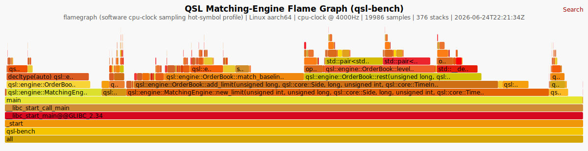
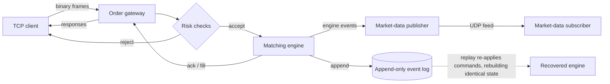

<div align="center">

# Quant Systems Lab

### A deterministic C++20 exchange simulator, profiled and tuned on bare-metal ARM64.

Binary order gateway. Price-time-priority matching engine. Market-data feed. Append-only event log. Replayable recovery. Cross-language differential testing. Reproducible `perf` evidence.

[](https://github.com/div0rce/quant-systems-lab/actions/workflows/ci.yml)
[](CMakeLists.txt)
[](tests/)
[](cmake/Sanitizers.cmake)
[](docs/invariants.md)
[](LICENSE)

</div>

> Clients send fixed-width binary orders over TCP. A gateway runs deterministic pre-trade risk
> checks. A multi-symbol matching engine applies them and emits a strictly increasing event stream
> that feeds a market-data publisher and an append-only log. Replaying that log on a fresh engine
> rebuilds **byte-identical** state. The core is a pure state machine with **integer-tick prices**
> and **zero wall-clock dependence**, so every run is reproducible and debuggable straight from the
> log.
>
> It is **not** a real exchange, a trading strategy, or connected to live markets, and it makes no
> profitability or production-latency claims. See [honest limits](#honest-limits).

---

## The numbers

Measured on a bare-metal Apple M2 (aarch64), Fedora Asahi, GCC 16, Release. The hot path was profiled
with `perf` and flamegraphs; the table compares the **v0.1.0 first release to v0.2.2** on the same
host and harness (baseline storage, deep book). Full evidence and the honest mechanism in
**[PERFORMANCE.md](PERFORMANCE.md)**.

<table>
<tr>
<td width="50%">

| Hot path (deep book) | v0.1.0 | v0.2.2 |
|---|--:|--:|
| **Allocations / order** | 4.09 | **1.11** |
| **Branch-miss rate** | 2.05% | **1.69%** |
| Throughput | 10.54M/s | **10.99M/s** |
| Cycles / order | 304.5 | **290.7** |
| IPC | 3.84 | **3.94** |
| p50 / p99 latency | 83 / 209 ns | 83 / 208 ns |

`-73%` allocations/order, `-18%` branch misses, determinism preserved.

</td>
<td width="50%">

| Quality bar | |
|---|---|
| Tests | **272** passing |
| Coverage | unit, integration, property, concurrency, shell |
| Sanitizers | ASan + UBSan (aborting) + TSan, clean |
| Determinism | snapshots byte-identical across GCC and Clang |
| Oracle | independent **OCaml** replay engine agrees |
| Prices | integer ticks, never floating point |

</td>
</tr>
</table>

Cache-miss counters are reported as **unavailable**, not estimated: the Apple Silicon PMU does not
expose them ([issue #90](https://github.com/div0rce/quant-systems-lab/issues/90)). Honesty over
round numbers.

## Where the cycles go

`make flamegraph` renders this with `perf --call-graph fp` and a dependency-free Python stackcollapse
(no external FlameGraph toolkit). It captures roughly 20k samples of a warm, bounded order flow,
fully symbolized, with zero `[unknown]` frames. Order-book insertion and matching dominate, exactly
as the optimization work targeted.

[](results/flamegraph.svg)

> Software cpu-clock sampling for hot-symbol investigation, not a latency claim. Frame width is
> proportional to on-CPU samples. The before/after call graphs that prove the tuning live in
> [docs/performance/](docs/performance/). GitHub renders the SVG statically; download the raw file
> for interactive zoom and search.

## Microbenchmarks

Single-process, in-process, hot-cache, Release. These **exclude** network I/O, disk `fsync`, the
kernel/socket path, and allocator tuning. Useful for regression detection and honest
order-of-magnitude framing only, never production throughput. One machine; numbers differ by
hardware. Full output in [`results/latest.txt`](results/latest.txt).

| Scenario (synthetic) | ns/op |
|---|--:|
| Order book add / modify / cancel | ~90 |
| Protocol `NewOrder` encode + decode | ~16 |
| Gateway session, crossing order with fill | ~102 |
| Matching-engine flow (apply) | ~91 |
| Replay from command log | ~101 |

Reproduce with `make bench`. These micro scenarios hold a near-empty order index, so they do not
exercise the deep-book steady state where the engine wins land (that is what [PERFORMANCE.md](PERFORMANCE.md)
measures). Methodology in [docs/benchmarking.md](docs/benchmarking.md) and
[docs/linux_performance.md](docs/linux_performance.md).

## Architecture



| Layer | Namespace | What it does |
|---|---|---|
| Core domain | `qsl::core` | Integer-tick prices, IDs, logical time, enums, invariants |
| Binary protocol | `qsl::protocol` | Fixed-width big-endian frames, explicit byte (de)serialization |
| Order book | `qsl::engine` | Price-time priority, partial fills, cancel and modify |
| Matching engine | `qsl::engine` | Multi-symbol routing, deterministic sequencing, snapshots |
| Risk and gateway | `qsl::gateway` | Pre-trade checks, in-process and TCP order entry |
| Market data | `qsl::feed` | Trade and top-of-book messages, UDP publisher, gap detection |
| Event log and replay | `qsl::replay` | Append-only log, deterministic replay and recovery |

Full design in [docs/architecture.md](docs/architecture.md). The tested guarantees are enumerated in
[docs/invariants.md](docs/invariants.md).

## What is actually interesting here

- **Determinism as a feature, not an accident.** The engine never reads wall-clock time and never
  uses floating point for price. Replaying the log on a cold engine yields byte-identical snapshots,
  checked in CI across two compilers.
- **An independent OCaml oracle.** A second engine, written functionally in OCaml (`ocaml/`),
  replays the same command streams and must compute the same snapshot. A seeded C++ property
  generator and a delta-debugging shrinker hunt for any disagreement and minimize it. This is
  cross-language differential testing, not a unit test.
- **Profiled, then optimized, then proven.** The hot path was found with `perf` and flamegraphs,
  tuned (`try_emplace`, hash load-factor), and the win was documented with hardware counters in
  [PERFORMANCE.md](PERFORMANCE.md), including a correction where the counters disproved the original
  hypothesis.
- **Hardened on purpose.** The acceptors survive `EINTR`, transient accept errors, and fd
  exhaustion; the UBSan gate aborts on the first violation (it used to silently recover); malformed
  frames, log records, and CLI args are rejected, not crashed on.

## Quickstart

Needs a C++20 compiler (Clang or GCC), CMake `>= 3.24`, and Ninja. The OCaml differential tests also
need OCaml and dune (`brew install ocaml dune`).

```bash
make build     # configure + build (auto-configures on a fresh clone)
make test      # unit / integration / property / concurrency suite
make demo      # end-to-end local demo (see below)
```

`make demo` runs two things on loopback:

1. **Replay and recovery.** Generates a deterministic synthetic command log (seed 42), inspects it
   with `qsl-loginspect`, then rebuilds engine state from it with `qsl-replay`.
2. **TCP round-trip.** Starts `qsl-gateway` on `127.0.0.1:9009`, sends a `NewOrder` and a `Heartbeat`
   with `qsl-client`, and prints the `Ack` / `HeartbeatAck`.

More targets: `make check` (format + build + test), `make asan` / `make tsan`, `make bench` /
`make bench-diff` / `make bench-storage`, `make flamegraph`, `make perf-stat` / `make perf-record`,
`make check-fixtures` / `make determinism`. The `qsl-perfeval` harness behind PERFORMANCE.md is a
build target too.

> The gateway is **unauthenticated** and binds **loopback only**. It is a local simulator for
> demonstration, not a venue. Do not expose it on a public interface.

## Cross-language differential testing (OCaml)

The C++ engine is the system under test; an **independent OCaml engine** replays the same command
streams and must compute the same final snapshot. In one breath: a seeded C++ property generator
produces command streams spanning the full command space (valid/invalid, duplicate/reused ids,
unknown symbols, IOC/market, cancel/modify, multi-symbol); the C++ engine exports a fixture; OCaml
replays the **commands only**; a differential test asserts its snapshot equals the C++ snapshot (best
bid/ask, level aggregates, order counts, last seq, trade count); and a shrinker reduces any
disagreement to a minimal counterexample. Fifty committed fixtures are golden-regenerated and
hash-manifest checked so they cannot drift, and a CI seed sweep replays further seeds on the fly.

This is cross-language differential plus property testing. It is **not** formal verification or a
correctness proof. Architecture and the exact "what this proves and does not prove" in
[docs/differential_testing.md](docs/differential_testing.md) and
[docs/property_testing.md](docs/property_testing.md). Build and run with `cd ocaml && dune runtest`.

## Honest limits

- **Synthetic and local.** No real market data, no venue connectivity, no order types beyond
  limit/market with GTC/IOC.
- **Microbenchmarks, not end-to-end latency.** See the caveats above the benchmark table.
- **Networking is scoped.** Loopback-only, unauthenticated TCP order entry plus a UDP feed. Both
  paths are hardened (connection cap, `EINTR` retry, accept-error and fd-exhaustion survival, per-tick
  accept fairness, UDP send-error counting) but this is robustness, not DoS protection or a capacity
  claim. Details in [docs/socket_gateway.md](docs/socket_gateway.md) and
  [docs/socket_hardening.md](docs/socket_hardening.md).
- **Perf evidence is partial.** Real Apple M2 PMU counters for cycles, instructions, branches, and
  branch-misses; cache counters are unsupported by this PMU
  ([#90](https://github.com/div0rce/quant-systems-lab/issues/90)). NUMA evidence is single-node.
- **Not production-hardened.** Persistence is a single append-only log with explicit durability
  modes and SIGKILL-validated torn-tail recovery ([docs/persistence.md](docs/persistence.md)), but no
  power-loss validation, no clustering, no exchange-grade clearing.

## Layout

```text
include/qsl/   public headers          src/          implementation
apps/          9 CLI tools             tests/        unit + invariant + fuzz tests
ocaml/         independent replay      docs/         design docs, ADRs, PERFORMANCE assets
               verifier + oracle       results/      benchmark + perf artifacts
scripts/       demo, bench, fixture, determinism, and perf/flamegraph helpers
```

## Positioning

Written to be defensible under technical questioning, not to impress with claims. Every claim is
currently **self-certified** (no external review has happened yet); adversarial technical criticism
is invited, see [docs/review_request.md](docs/review_request.md) with the auditable outcome record in
[docs/review_feedback.md](docs/review_feedback.md). Conservative resume framing in
[docs/recruiting_notes.md](docs/recruiting_notes.md). The build plan is in
[MILESTONES.md](MILESTONES.md); incremental decisions in [PROGRESS.md](PROGRESS.md).

Licensed under the [MIT License](LICENSE). See [CONTRIBUTING.md](CONTRIBUTING.md) for the
branch-per-milestone workflow, [SECURITY.md](SECURITY.md) for the loopback-only network caveats, and
[CHANGELOG.md](CHANGELOG.md) for history.
