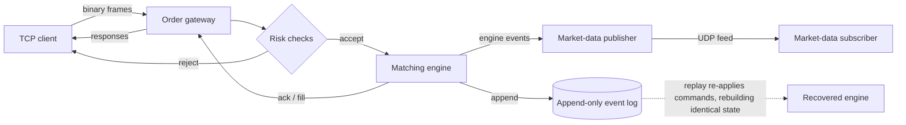

# Quant Systems Lab

A deterministic C++20 exchange simulator: a binary order gateway, a price-time-priority
matching engine, a market-data publisher, an append-only event log, a replay/recovery path,
and reproducible micro-benchmarks. Built as a systems-engineering portfolio project.

**In 60 seconds:** clients send fixed-width binary orders over TCP; a gateway runs deterministic
pre-trade risk checks; a multi-symbol matching engine applies them and emits a
strictly-increasing event stream; those events drive a market-data feed and an append-only
log. Replaying the log on a fresh engine reproduces identical engine state, verified by
snapshot equality — the core is a deterministic state machine with **integer-tick prices** and
**no wall-clock dependence**, so every run is reproducible and debuggable from the log.

**It is not** a production exchange, a trading strategy, or connected to real markets, and it
makes no profitability claims. See [Limitations](#limitations).

## Architecture



The full architecture, including the cross-language verification pipeline, is in
[docs/architecture.md](docs/architecture.md).

| Layer | Namespace | What it does |
|---|---|---|
| Core domain | `qsl::core` | Integer-tick prices, IDs, logical time, enums, invariants |
| Binary protocol | `qsl::protocol` | Fixed-width big-endian frames; explicit byte (de)serialization |
| Order book | `qsl::engine` | Price-time priority, partial fills, cancel/modify |
| Matching engine | `qsl::engine` | Multi-symbol routing, deterministic sequencing, snapshots |
| Risk + gateway | `qsl::gateway` | Pre-trade checks, in-process + TCP order entry |
| Market data | `qsl::feed` | Trade / top-of-book messages, UDP publisher, gap detection |
| Event log + replay | `qsl::replay` | Append-only log, deterministic replay/recovery |

Detailed design is in [docs/architecture.md](docs/architecture.md); tested guarantees are in
[docs/invariants.md](docs/invariants.md).

## Quickstart

From a clean clone (needs a C++20 compiler — Clang or GCC — plus CMake ≥ 3.24 and Ninja; the
OCaml differential tests additionally need OCaml + dune, e.g. `brew install ocaml dune`):

```bash
make build     # configure + build (auto-configures on a fresh clone)
make test      # run the unit/integration suite
make demo      # end-to-end local demo (see below)
```

Other targets: `make check` (format-check + build + test), `make fmt`, `make asan`
(AddressSanitizer + UBSan), `make tsan` (ThreadSanitizer over concurrency-labelled tests),
`make concurrency-stress` (opt-in repeated concurrency validation), `make bench` /
`make bench-diff` / `make bench-storage` (committed benchmark harnesses), `make check-fixtures`
(regenerate the differential fixtures and verify they match current C++ output),
`make check-manifest` (verify the fixture provenance manifest), and `make determinism` (assert
fixtures are byte-identical across compilers). Systems evidence targets include
`make false-sharing-study`, plus Linux-only `make profile-io`, `make socket-load`, and
`make numa-study`; `make socket-stress` runs the UDP socket-buffer experiment where supported.

## Demo

`make demo` (or `bash scripts/demo.sh`) runs two things locally:

1. **Replay/recovery** — generates a deterministic synthetic command log (seed 42), inspects
   it with `qsl-loginspect`, then rebuilds engine state from it with `qsl-replay`.
2. **TCP gateway round-trip** — starts `qsl-gateway` on `127.0.0.1:9009`, sends a `NewOrder`
   and a `Heartbeat` with `qsl-client`, and prints the `Ack` / `HeartbeatAck` responses.

> Security note: the gateway is **unauthenticated** and binds **loopback only**. It is a local
> simulator for demonstration, not a real venue; do not expose it on a public interface.

## Benchmarks

These are **single-process synthetic microbenchmarks** produced by the committed harness
(`make bench`) — hot-cache, in-process, Release build. They **exclude** network I/O, disk
`fsync`, the kernel/socket path, allocator tuning, CPU pinning, and any production deployment
concern. They are **not** production exchange throughput or end-to-end latency, and they are
hardware-, compiler-, and build-dependent — useful for regression detection and honest
order-of-magnitude framing only.

The run below is one machine: arm64 / Apple clang 17 / Release / fixed seed 42. Full output
and metadata are in [`results/latest.txt`](results/latest.txt); methodology and caveats in
[docs/benchmarking.md](docs/benchmarking.md) and [docs/linux_performance.md](docs/linux_performance.md).

| Scenario (synthetic, in-process) | Measured on this run |
|---|---|
| Order book add/modify/cancel | ~126 ns/op |
| Protocol `NewOrder` encode+decode | ~39 ns/op |
| Gateway session, crossing order with fill | ~270 ns/op |
| Matching-engine flow (apply) | ~121 ns/command |
| Replay from command log | ~132 ns/command |

Reproduce with `make bench` (numbers will differ by machine). The differential-testing harness
(generation, replay, shrinking) has its own benchmark — `make bench-diff`, written to
[`results/differential.txt`](results/differential.txt) — kept separate so it does not disturb
the core numbers above.

## Limitations

- **Synthetic and local.** No real market data, no real venue connectivity, no order types
  beyond limit/market + GTC/IOC.
- **Networking remains scoped.** The default TCP gateway is intentionally
  loopback-only and unauthenticated. It now has portable threaded serving for multiple clients, and
  Linux builds also include an opt-in `epoll` gateway prototype for event-driven readiness. These
  are architecture and pressure-validation paths, not a production event loop or capacity claim.
- **Benchmarks are microbenchmarks**, not end-to-end or production latency (see above).
  CPU-affinity/scheduler-migration and false-sharing studies are separate hardware-dependent
  artifacts; contiguous order-book storage is a bounded-domain architecture study, not a general
  cache-locality or production-latency claim.
- **Networking is minimal**: loopback TCP order entry and a UDP market-data feed,
  unauthenticated, no TLS, no framing recovery beyond disconnect-on-malformed. The socket path is
  profiled and its hardening posture documented in
  [docs/socket_profiling.md](docs/socket_profiling.md) and
  [docs/socket_hardening.md](docs/socket_hardening.md) (loopback-only, constrained evidence).
- **Not production-hardened**: persistence is a single append-only event log — now with
  explicit durability modes and SIGKILL-validated torn-tail recovery
  ([docs/persistence.md](docs/persistence.md)), but no power-loss/OS-crash validation, no
  segmentation or snapshots, and acks are not coupled to durability. No clustering, no
  exchange-grade risk/clearing.

## Differential testing (OCaml)

The C++ engine is the system under test; an **independent OCaml engine** (`ocaml/`) replays the
same command streams and must compute the same final snapshot. In 60 seconds: a seeded C++
**property generator** produces command streams spanning the full command space (valid/invalid,
duplicate/reused ids, unknown symbols, IOC/market, cancel/modify, multi-symbol); the C++ engine
exports a fixture (commands + its snapshot); OCaml replays the **commands only** and the
**differential test** asserts its snapshot equals the C++ snapshot (best bid/ask, level
aggregates, order counts, last_seq, trade count); a **shrinker** reduces any disagreement to a
minimal counterexample. The fifty committed property fixtures (`prop_seed1..50`) are
golden-regenerated and provenance-checked (a hash manifest) so they cannot drift; a dynamic CI
seed sweep additionally replays further seeds on the fly (the swept fixtures are ephemeral, not
committed).

This is cross-language differential + property testing — **not** formal verification or a
correctness proof. An earlier OCaml layer also checks log invariants directly
([docs/ocaml_verifier.md](docs/ocaml_verifier.md)). Architecture and exact "what this proves /
does not prove" are in [docs/differential_testing.md](docs/differential_testing.md) and
[docs/property_testing.md](docs/property_testing.md) (which also covers the oracle-independence
audit and the [regression archive](regressions/README.md)); build/test with
`cd ocaml && dune runtest`.

## Repository layout

```text
include/qsl/   public headers          src/          implementation
apps/          8 CLI tools (gateway,   tests/        unit + invariant + fuzz tests
               client, replay, feed,   docs/         design docs + ADRs
               log inspect, bench,     ocaml/        independent replay verifier + oracle
               fixture + stream        regressions/  archived minimal failing fixtures
               exporters)              results/      benchmark outputs (latest, differential)
scripts/       demo + benchmark + fixture/determinism checks
```

## Positioning

This repo is written to be defensible under technical questioning, not to impress with
claims. Every claim is currently **self-certified** (no external review has happened yet);
adversarial technical criticism is explicitly invited — see
[docs/review_request.md](docs/review_request.md), with the honest, auditable outcome record in
[docs/review_feedback.md](docs/review_feedback.md). Positioning notes and conservative résumé
bullets are in [docs/recruiting_notes.md](docs/recruiting_notes.md). The build plan is in
[MILESTONES.md](MILESTONES.md); incremental decisions are logged in [PROGRESS.md](PROGRESS.md).

Licensed under the [MIT License](LICENSE). See [CONTRIBUTING.md](CONTRIBUTING.md) for the
branch-per-milestone workflow and checks, [SECURITY.md](SECURITY.md) for the (loopback-only,
unauthenticated) network-service caveats, and [CHANGELOG.md](CHANGELOG.md) for history.
