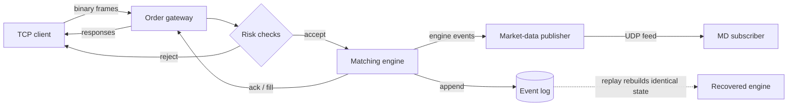

# Quant Systems Lab

A deterministic C++20 exchange simulator: a binary order gateway, a price-time-priority
matching engine, a market-data publisher, an append-only event log, a replay/recovery path,
and reproducible micro-benchmarks. Built as a systems-engineering portfolio project.

**In 60 seconds:** clients send fixed-width binary orders over TCP; a gateway runs deterministic
pre-trade risk checks; a multi-symbol matching engine applies them and emits a
strictly-increasing event stream; those events drive a market-data feed and an append-only
log. Replaying the log on a fresh engine reproduces identical engine state, verified by
snapshot equality — the core is a deterministic state machine with **integer-tick prices** and
**no wall-clock dependence**, so every run is reproducible and debuggable from the log.

**It is not** a production exchange, a trading strategy, or connected to real markets, and it
makes no profitability claims. See [Limitations](#limitations).

## Architecture



| Layer | Namespace | What it does |
|---|---|---|
| Core domain | `qsl::core` | Integer-tick prices, IDs, logical time, enums, invariants |
| Binary protocol | `qsl::protocol` | Fixed-width big-endian frames; explicit byte (de)serialization |
| Order book | `qsl::engine` | Price-time priority, partial fills, cancel/modify |
| Matching engine | `qsl::engine` | Multi-symbol routing, deterministic sequencing, snapshots |
| Risk + gateway | `qsl::gateway` | Pre-trade checks, in-process + TCP order entry |
| Market data | `qsl::feed` | Trade / top-of-book messages, UDP publisher, gap detection |
| Event log + replay | `qsl::replay` | Append-only log, deterministic replay/recovery |

Detailed design is in [docs/architecture.md](docs/architecture.md); tested guarantees are in
[docs/invariants.md](docs/invariants.md).

## Quickstart

From a clean clone (needs a C++20 compiler — Clang or GCC — plus CMake ≥ 3.24 and Ninja):

```bash
make build     # configure + build (auto-configures on a fresh clone)
make test      # run the unit/integration suite
make demo      # end-to-end local demo (see below)
```

Other targets: `make check` (format-check + build + test), `make fmt`, `make asan`
(AddressSanitizer + UBSan), `make bench` (build the bench preset and write
`results/latest.txt`).

## Demo

`make demo` (or `bash scripts/demo.sh`) runs two things locally:

1. **Replay/recovery** — generates a deterministic synthetic command log (seed 42), inspects
   it with `qsl-loginspect`, then rebuilds engine state from it with `qsl-replay`.
2. **TCP gateway round-trip** — starts `qsl-gateway` on `127.0.0.1:9009`, sends a `NewOrder`
   and a `Heartbeat` with `qsl-client`, and prints the `Ack` / `HeartbeatAck` responses.

> Security note: the gateway is **unauthenticated** and binds **loopback only**. It is a local
> simulator for demonstration, not a real venue; do not expose it on a public interface.

## Benchmarks

These are **single-process synthetic microbenchmarks** produced by the committed harness
(`make bench`) — hot-cache, in-process, Release build. They **exclude** network I/O, disk
`fsync`, the kernel/socket path, allocator tuning, CPU pinning, and any production deployment
concern. They are **not** production exchange throughput or end-to-end latency, and they are
hardware-, compiler-, and build-dependent — useful for regression detection and honest
order-of-magnitude framing only.

The run below is one machine: arm64 / Apple clang 17 / Release / fixed seed 42. Full output
and metadata are in [`results/latest.txt`](results/latest.txt); methodology and caveats in
[docs/benchmarking.md](docs/benchmarking.md) and [docs/linux_performance.md](docs/linux_performance.md).

| Scenario (synthetic, in-process) | Measured on this run |
|---|---|
| Order book add/modify/cancel | ~126 ns/op |
| Protocol `NewOrder` encode+decode | ~39 ns/op |
| Gateway session, crossing order with fill | ~270 ns/op |
| Matching-engine flow (apply) | ~121 ns/command |
| Replay from command log | ~132 ns/command |

Reproduce with `make bench` (numbers will differ by machine).

## Limitations

- **Synthetic and local.** No real market data, no real venue connectivity, no order types
  beyond limit/market + GTC/IOC.
- **Single-threaded** gateway and feed (a single accept/event loop); no concurrency model.
- **Benchmarks are microbenchmarks**, not end-to-end or production latency (see above).
- **Networking is minimal**: loopback TCP order entry and a UDP market-data feed,
  unauthenticated, no TLS, no framing recovery beyond disconnect-on-malformed.
- **Not production-hardened**: no persistence beyond the flat event log, no clustering,
  no exchange-grade risk/clearing.

## Independent replay verifier (OCaml)

A small OCaml subproject (`ocaml/`) independently checks exported event-log fixtures against
replay invariants (sequence monotonicity, positive trade quantities, canceled-can't-trade,
rejected-can't-rest, and event-log/summary consistency). It does not re-implement the engine
and is not formal verification — it is a cross-check in a typed functional language that
validates the *output* of the C++ pipeline. Details in
[docs/ocaml_verifier.md](docs/ocaml_verifier.md); build/test with `cd ocaml && dune runtest`.

## Repository layout

```text
include/qsl/   public headers          src/          implementation
apps/          CLI tools (gateway,     tests/        unit + invariant + fuzz tests
               client, replay, feed,   docs/         design docs + ADRs
               fixture exporter)       ocaml/        independent replay verifier
scripts/       demo + benchmark        results/      benchmark outputs
```

## Positioning

This repo is written to be defensible under technical questioning, not to impress with
claims. Positioning notes and conservative résumé bullets are in
[docs/recruiting_notes.md](docs/recruiting_notes.md). The build plan is in
[MILESTONES.md](MILESTONES.md); incremental decisions are logged in [PROGRESS.md](PROGRESS.md).
