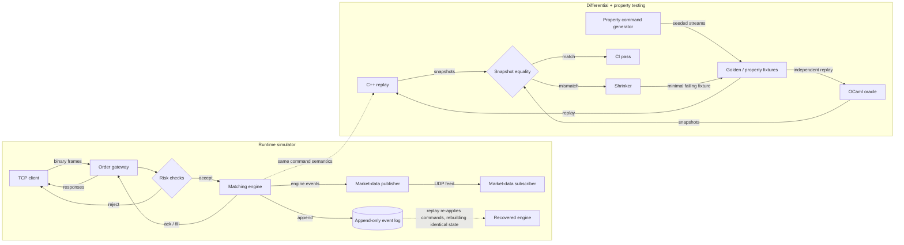

# Architecture

A deterministic C++20 exchange simulator. Components are layered so that the
network/replay/feed layers depend on the protocol layer, which depends on the core domain;
the matching core never depends on wall-clock time or floating point.

## Overview

Concise system flow:

```text
Client -> Gateway -> Risk -> Matching Engine -> Replay Log -> Recovery -> Verification / Differential Testing
```

The gateway and risk layer define the protocol boundary and deterministic rejection behavior. The
matching engine owns price-time-priority state. The replay log and recovery path make state
reconstruction auditable, while the C++/OCaml differential and property tests challenge the same
command semantics through an independent implementation.



## Components

- **Core types**, integer ticks, order IDs, sequence numbers
- **Binary protocol**, fixed-width encode/decode (M2)
- **Order book**, price-time priority (M3)
- **Matching engine**, multi-symbol sequencing (M4)
- **Risk**, deterministic pre-trade checks (M5)
- **Market data**, trade/top-of-book publisher (M6)
- **Event log**, append-only replayable log (M7)
- **Replay/recovery**, rebuild state from log (M8)
- **TCP gateway**, binary order gateway (M9)
- **Benchmarks**, reproducible performance measurement (M11)
- **OCaml replay verifier + oracle**, independent typed-functional replay (M14, M16)
- **Differential + property testing**, command-stream export, C++≡OCaml snapshot equality,
  seeded property generator, and a shrinker that minimizes any divergence (M15-M19)
- **Concurrency primitive + threaded pipeline**, a bounded SPSC ring buffer and an optional
  three-thread gateway→engine→publisher/log pipeline prototype (M24-M26)
- **Order-book storage modes**, baseline, PMR-pooled (M32), intrusive `OrderPool` (PR #112),
  and a bounded-domain contiguous direct-price-index layout (M47); all produce identical
  deterministic event streams and snapshots
- **epoll gateway prototype**, an optional Linux event-driven multi-client transport alongside
  the default portable threaded TCP server (M34)
- **Event-log durability + recovery**, caller-chosen durability modes (buffered / flush / fsync)
  with torn-tail classification and provably-torn repair (M45)

The first block is the runtime simulator; the last two are the cross-language verification
pipeline (the **Verification** subgraph above). Detailed differential-testing docs are in
[differential_testing.md](differential_testing.md) and [property_testing.md](property_testing.md).
Storage modes, durability/recovery, the epoll prototype, and the Linux perf/socket/NUMA studies
each have their own doc under `docs/` and a dedicated `make` target.

## Core domain model (M1)

Defined in `include/qsl/core/`.

### Integer price ticks

Prices are integer ticks (`Price = std::int64_t`), never floating point. A tick
scale maps display prices to integers: at `kTickScale = 100`, `$123.45` is stored
as `12345`. This keeps arithmetic exact and matching deterministic, floating-point
rounding would make fills and price-time priority non-reproducible.

Other domain aliases: `SymbolId` (u32), `Quantity` (u32), `OrderId` (u64),
`SeqNo` (u64).

### Deterministic (logical) time

`LogicalClock` (`clock.hpp`) produces a monotonic `Timestamp` (u64) that is
independent of wall-clock time. Core engine paths use logical time only, so a
recorded command stream replays to an identical state. Wall-clock time is allowed
only at the gateway boundary and benchmark layer, never inside matching.

### Enums and validation

`Side`, `OrderType`, and `TimeInForce` are fixed-width enums with `is_valid` and
`to_string` helpers. `RejectReason` plus the lightweight `Result` type
(`result.hpp`) give structured, deterministic rejection of invalid input;
`invariants.hpp` holds the domain validity predicates.

## Matching engine (M4)

`MatchingEngine` (`include/qsl/engine/matching_engine.hpp`) wraps the single-symbol
`OrderBook` into a multi-symbol engine.

- **Symbol registry**, `SymbolRegistry` interns external symbol names to compact
  `SymbolId`s assigned in registration order. The engine holds one `OrderBook` per
  registered symbol in a `std::map<SymbolId, OrderBook>` (ordered, for deterministic
  snapshot iteration).
- **Command application**, `new_limit` / `new_market` / `cancel` / `modify` route to the
  symbol's book. A command for an unregistered symbol (or a cancel/modify of an unknown
  order) is a no-op here; structured rejection is the risk layer's job (M5).
- **Active order IDs**, a resting `OrderId` is unique within each symbol book. Duplicate
  active IDs are ignored in M4 before any acceptance event or sequence number is emitted
  so the book's locator index cannot be corrupted. M5 turns this condition into a
  structured `DuplicateOrderId` rejection.
- **Event stream**, commands emit `EngineEvent`, a `std::variant` of `OrderAccepted`,
  `OrderCanceled`, `OrderModified`, and `TradeEvent` (`engine/events.hpp`). A new order
  emits `OrderAccepted` followed by a `TradeEvent` per fill. `OrderRejected` (M5) and
  `BookUpdate` (M6) are added later.
- **Sequencing**, every emitted event carries a `SeqNo` from a single monotonic counter,
  so event sequence numbers are strictly increasing across all symbols and commands.
- **Snapshot**, `snapshot()` returns a deterministic `EngineSnapshot` (last sequence
  number plus per-symbol best bid/ask and resting order count, ordered by `SymbolId`) for
  replay-equivalence comparison. M8 extends it with per-level aggregates and the trade
  sequence.

The engine has no wall-clock dependence; ordering and sequencing are logical.

## Risk checks and in-process gateway (M5)

The `OrderGateway` (`include/qsl/gateway/order_gateway.hpp`) is the risk boundary in front
of the engine:

```text
ClientCommand -> OrderGateway (risk) -> MatchingEngine -> EngineEvents
```

- **Value checks** (`engine/risk.hpp`, `RiskConfig` + `check_limit`/`check_market`) are pure
  and deterministic: invalid side, invalid price tick (price must be positive), invalid
  quantity, max order quantity, and max notional. The notional check is overflow-safe, it compares `quantity > max_notional / price` rather than computing `price * quantity`.
  Side validation applies to `new_limit` and `new_market`; modify has no side parameter.
  Modify commands that leave a nonzero resting order are re-checked against the same
  limit-order value constraints before reaching the engine. Modify quantity `0` remains
  cancel-via-modify.
- **Identity checks** live in the gateway, which knows engine state: an unregistered symbol
  rejects with `UnknownSymbol`; a new order whose id is already **active** (resting) rejects
  with `DuplicateOrderId`; a cancel/modify of an id that is not resting rejects with
  `UnknownOrder`. "Duplicate" and "unknown" are thus defined by current engine state
  (`MatchingEngine::has_symbol` / `contains`), consistent with the engine's no-op on a
  duplicate active id. The M4 engine/book duplicate guards remain as invariant defense.
  Completed-order ids are not retained, so they may be reused.
- **Structured result**, every submission returns a `GatewayResult{accepted, reason,
  events}`. A rejection carries a `RejectReason` and no events and never reaches the engine
  (so the engine's sequence counter and state are untouched); an acceptance carries the
  engine's resulting event stream. Rejections are intentionally *not* part of the engine's
  sequenced event stream because they do not mutate engine state (which keeps replay clean).
- **Opt-in storage guards**, when the explicit intrusive order-pool storage mode is selected,
  a GTC limit order that would need to rest but cannot acquire an order node is rejected with
  `StorageExhausted` before matching mutates state. The M47 contiguous storage mode similarly
  rejects a GTC remainder that would have to rest outside its fixed direct-price-index band,
  and pre-gates modifies the same way (`can_apply_modify`): a reprice whose re-add remainder
  would rest out of band is rejected with `StorageExhausted` before the engine emits
  `OrderModified`, so the original order keeps resting and the event stream never reports an
  unapplied modify. Baseline and PMR storage are unchanged.

Checks run in a fixed order so the returned reason is deterministic when multiple would
apply: unknown symbol, duplicate id, then value checks (side, price, quantity, max
quantity, max notional), then the opt-in storage guard.

## Market data publisher (M6)

`MarketDataPublisher` (`include/qsl/feed/publisher.hpp`) consumes the engine event stream
and produces market-data messages for subscribers:

```text
EngineEvents -> MarketDataPublisher -> MarketDataSubscriber(s)
```

- **Messages** (`feed/market_data.hpp`), `MarketDataMessage` is a `std::variant` of
  `MdTrade` (symbol, price, quantity) and `MdTopOfBook` (symbol, optional best bid/ask).
  Each carries a monotonic `md_seq`. `BookDelta`/`Snapshot` (full depth) are deferred to a
  later networked-feed milestone.
- **Derivation**, `publish(engine, events)` is called once per applied command. Each
  `TradeEvent` yields an `MdTrade`; after the batch, each touched symbol whose top of book
  differs from the publisher's last observed top (read from the engine) yields an
  `MdTopOfBook`. First observation of an empty book initializes publisher state but emits
  no TOB, because no observable top changed. Transitions from non-empty to empty do emit
  TOB because the top changed. A resting order behind the best produces no message.
- **Sequencing**, every emitted message gets the next `md_seq` from a single monotonic
  counter, and messages are emitted in engine-event order, so the market-data sequence is
  monotonic and follows the engine sequence.
- **Subscriber interface**, `MarketDataSubscriber::on_market_data` is the delivery hook;
  the publisher fans out to all registered subscribers.
- **Wire encoding**, `MdTrade`/`MdTopOfBook` encode via the M2 binary protocol framing
  (`MsgType::MdTrade`/`MdTopOfBook`), reusing the shared header writer and big-endian
  helpers; `md_seq` travels in the header's sequence field.

The publisher has no wall-clock dependence; ordering and sequencing are logical, and it
adds no nondeterminism (top-of-book is read from the deterministic engine).

## Network market data feed (M10)

The in-process `MarketDataPublisher` (M6) is exposed over the network by `UdpPublisher`
(`include/qsl/feed/udp_feed.hpp`), a `MarketDataSubscriber` that encodes each message with
the binary protocol and sends it as one UDP datagram:

```text
engine events -> MarketDataPublisher -> UdpPublisher --UDP--> UdpFeedClient -> SequenceTracker
```

- **Datagram = message**: each `MdTrade`/`MdTopOfBook` is one self-contained UDP datagram
  (header + body), decoded on the receiver by `decode_market_data`, which dispatches on the
  header's message type.
- **Gap detection**: `SequenceTracker` (`feed/sequence_tracker.hpp`) is pure and socket-free.
  It compares each message's `md_seq` to the last seen and reports how many were missed; it
  does not recover them. Duplicates and reordered (lower) sequence numbers are ignored.
- **Client**: `UdpFeedClient` binds a UDP socket, receives datagrams, decodes them, and runs
  each `md_seq` through the tracker, accumulating a total gap count. The receive socket has a
  bounded `SO_RCVTIMEO` timeout, so `receive()` returns `std::nullopt` instead of blocking
  forever when no datagram arrives (the `qsl-mdfeed subscribe N` demo therefore cannot hang
  indefinitely waiting for fewer than `N` messages).
- **Testing strategy**: gap detection is verified deterministically by **injecting
  out-of-sequence datagrams** (publishing `md_seq` 1 then 3 and asserting the client observes
  a gap of one) through the real receive/decode/client path, never by relying on
  nondeterministic packet loss.

### Local demo

```bash
make build
./build/dev/qsl-mdfeed subscribe 9020 20   # terminal 1: receive 20 messages, report gaps
./build/dev/qsl-mdfeed publish   9020       # terminal 2: stream a synthetic flow's market data
```

### Networking limitations (honest)

- **UDP is connectionless and lossy.** There is no retransmit, no flow control, and no
  ordering guarantee across datagrams. The feed *detects* loss via sequence gaps; it does not
  recover it (a real venue would offer a snapshot/recovery channel, not implemented here).
- **Unicast localhost only.** It binds/sends on `127.0.0.1`. There is no multicast, no
  authentication, and no encryption. Do not expose it on an untrusted network.
- **No fragmentation handling.** Messages are small (well under the MTU), so each fits in one
  datagram; large messages are out of scope.
- This is a credible systems demonstration of a sequenced UDP feed with gap detection, not a
  production market-data distribution system.

## Concurrency: SPSC queues and the threaded pipeline (M24-M26)

Phase III adds a concurrency boundary on top of the deterministic core without changing its
semantics. `SpscRing<T, Capacity>` (`include/qsl/concurrency/spsc_ring.hpp`) is a bounded
single-producer/single-consumer queue, and `ThreadedPipeline<InboundCapacity, OutboundCapacity>`
(`include/qsl/concurrency/pipeline.hpp`) wires three single-threaded stages through two such queues:

```text
input thread -> inbound SpscRing<Command> -> engine thread -> outbound SpscRing<ProcessedCommand> -> publisher/log thread
```

The engine thread is the sole owner of the `MatchingEngine` + `OrderGateway`, so matching stays
deterministic; the boundary is a value hand-off, not shared engine state. Both queues are lossless
(spin/yield on full), shutdown is drain-then-stop via per-stage done-flags, and the rings outlive
both threads (joined before the run returns). The threaded run is verified to produce the identical
final snapshot and ordered event stream as the single-threaded path, and the concurrently written
command log replays to the same state. Design, memory ordering, and honest limits (SPSC only, no
latency claims, ASan ≠ race detection, ThreadSanitizer is M27) are documented in
[concurrency_model.md](concurrency_model.md) and [memory_ordering.md](memory_ordering.md).
