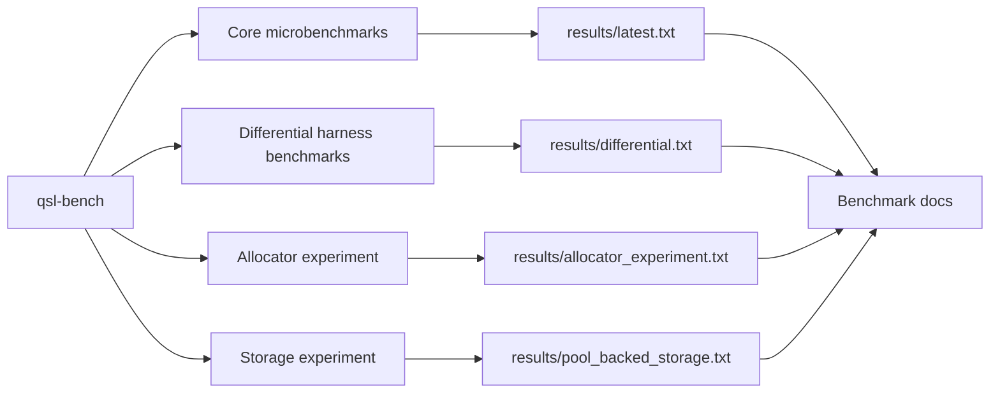

# Benchmarking

Reproducible latency and throughput measurements for the deterministic core. All numbers are
produced by the committed harness (`apps/qsl-bench`) and written to `results/`; none are
hand-written.



## Policy

No performance number appears in the README, PROGRESS, resume bullets, or any doc unless it
was produced by a committed benchmark target and recorded under `results/`. Benchmark results are
**hardware-, compiler-, and build-dependent**; the committed `results/latest.txt` records the
machine and toolchain it came from, and a different machine will produce different numbers.

## Harness

`apps/qsl-bench/main.cpp` is a small custom harness (no external benchmark dependency):

- `latency(name, iters, op)` — runs `op` `iters` times after a warmup and reports ns/op and
  ops/sec.
- `throughput(name, items, reps, run)` — runs `run` (which processes `items` items) `reps`
  times after a warmup and reports ns/item and items/sec.

A `volatile` sink consumes each operation's result so the optimizer cannot elide the work.
Timing uses `std::chrono::steady_clock` — wall-clock at the **benchmark layer only**; the
deterministic engine never reads a clock.

`make bench` uses a benchmark-specific CMake preset (`bench`) with
`QSL_BUILD_TESTS=OFF` and `QSL_BUILD_BENCHMARKS=ON`. This keeps benchmark configuration
separate from test-only dependencies: Catch2 `FetchContent` is not entered or populated for
benchmark-only builds.

## Scenarios

| Benchmark                  | Measures                                                        |
|----------------------------|-----------------------------------------------------------------|
| `order_book add/mod/cancel`| single-symbol order-book op latency over a bounded price band   |
| `protocol encode+decode`   | binary `NewOrder` round-trip latency                            |
| `gateway session IOC`      | end-to-end in-process gateway latency (decode → risk → engine → encode) for one IOC order |
| `matching engine flow`     | command-application throughput over a synthetic multi-symbol flow |
| `replay command log`       | state-rebuild throughput replaying a recorded command log       |

## Deterministic seeds

The matching and replay scenarios use `replay::generate_flow(seed = 42, symbols = 4,
orders = 5000)` — a fixed `mt19937_64` seed, so the workload is identical run to run and on
any machine. The generator is still synthetic, but it is stateful: per-symbol mid-prices drift,
orders mostly rest near the book, cancels/modifies preferentially target active orders, and
occasional market/crossing flow creates trades. Changing the seed, sizes, or generator version
changes the workload; the committed results state the parameters used.

## Report format

`scripts/run_benchmarks.sh` writes `results/latest.txt` with a metadata header followed by the
harness output:

```text
Hardware:    <arch>
OS:          <kernel>
Compiler:    <version>
Build type:  Release
Provenance version: 1
Git commit (informational): <short sha>
Source digest: sha256:<declared-source-input digest>
Source digest scope: <artifact scope>
Dirty inputs: no
Generated output: results/latest.txt
Dataset:     synthetic order flow (seed 42, 4 symbols)
Date:        <UTC timestamp>

Scenario / Metric / Result:
<one line per benchmark: ns/op + ops/sec, or ns/item + items/sec>
```

For migrated artifacts, `Source digest` is the stable provenance identity. Commit hashes are
informational because review branches are normally rebased and squash-merged.

## Running

```bash
make bench   # configures + builds the bench preset, runs qsl-bench, writes results/latest.txt
```

The differential-testing harness has its own benchmark (generation, gateway replay, and
shrinking of property command streams), kept separate so it does not disturb the core numbers:

```bash
make bench-diff   # runs qsl-bench diff, writes results/differential.txt
```

The allocator experiment is also separate. It compares baseline `new/delete` for `engine::Order`
against a fixed-capacity `OrderPool` acquire/release path and writes full metadata:

```bash
make bench-allocator   # runs qsl-bench pool, writes results/allocator_experiment.txt
```

The storage experiment is separate from the M28 allocator microbenchmark. It replays deterministic
engine workloads through baseline order-book storage, PMR-backed container-node allocation,
intrusive `OrderPool`-backed resting-order nodes, and the M47 fixed-band contiguous
direct-price-indexed storage mode. The storage artifact includes a non-timed workload-shape line
for each variant plus median/min/max timing of the post-registration command path per replay
(per-run setup -- engine construction and symbol registration -- and the end-of-run snapshot are
excluded so each number reflects per-command work):

```bash
make bench-storage   # runs qsl-bench storage, writes results/pool_backed_storage.txt
```

M44 adds a benchmark-only cache-line contention study for the SPSC queue cursors. It compares a
packed control layout against a cache-line-padded layout using the same release/acquire cursor
ownership pattern as the production queue. It does not change production queue layout or matching
behavior:

```bash
make false-sharing-study   # runs qsl-bench false-sharing, writes results/false_sharing_study.txt
```

M46 adds recovery benchmarking: the cost of a full-replay restart (log read/verify/classify via
`recover_log_file`, then decode+apply into a fresh engine) at several log lengths, against a
benchmark-only in-memory snapshot-restoration prototype (capture resting state via
`resting_orders`, rebuild the book from it) at several live-state depths. Every phase
self-verifies against the reference snapshot before its numbers are reported. The measured
recovery objective is restart cost on the generating host; data-loss bounds belong to the M45
durability modes (`make crash-recovery`). See the recovery-cost section of
`docs/replay_and_recovery.md`:

```bash
make bench-recovery   # runs qsl-bench recovery, writes results/recovery_benchmarks.txt
```

## What these numbers do and do not prove

- They **do** give a reproducible, order-of-magnitude picture of the core's latency/throughput
  on a stated machine, useful for spotting regressions and for honest résumé framing.
- They **do not** represent production trading latency. There is no kernel-bypass networking,
  no CPU pinning or isolation, no hugepages, and timing includes allocator and `std::map`
  overhead. CPU frequency scaling/turbo and a shared machine add noise. The false-sharing study is
  host-local cache-line evidence only. The recovery benchmark measures restart cost on a warm
  local filesystem, not a production recovery-time objective. See `docs/linux_performance.md` for
  how to reason about and tighten such measurements.
