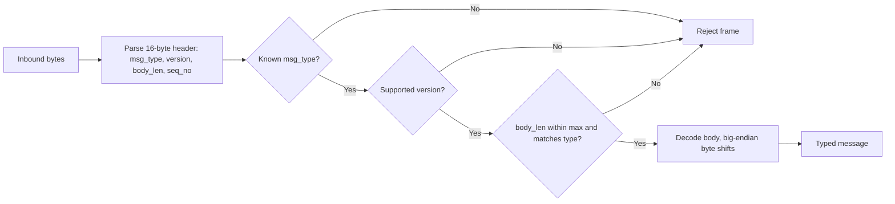

# Binary Protocol

Fixed-width binary protocol for the order gateway and (later) market data. Implemented
in `include/qsl/protocol/` and `src/protocol/codec.cpp`.

## Design goals

- Fixed-width messages for predictable parsing.
- **Big-endian (network byte order)** at the protocol boundary.
- **Explicit serialization** via byte shifts (`endian.hpp`), no `reinterpret_cast`,
  no `memcpy`, no struct overlay, so there is no undefined behavior from layout/aliasing.
- A version field for forward compatibility.
- Deterministic rejection of malformed frames.

Internal engine structs are independent of this wire layout.

## Frame

A frame is a fixed **16-byte header** followed by a variable-length body:

| Offset | Size | Field      | Type         | Notes                                   |
| -----: | ---: | ---------- | ------------ | --------------------------------------- |
|      0 |    2 | `type`     | u16          | message type (`MsgType`)                |
|      2 |    2 | `version`  | u16          | protocol version (`= 1`)                |
|      4 |    4 | `body_len` | u32          | body byte count (header excluded)       |
|      8 |    8 | `seq`      | u64          | sequence number                         |
|     16 | `body_len` | `body` | bytes        | message payload                         |

All multi-byte integers are big-endian. `body_len` counts body bytes only (the header
is fixed at 16 bytes). Signed `Price` is transported as its 64-bit two's-complement
bit pattern (`std::int64_t` <-> `std::uint64_t` via `static_cast`, which is well-defined).

- Protocol version: `kProtocolVersion = 1`
- Header size: `kHeaderSize = 16`
- Maximum body length: `kMaxBodyLen = 4096`

## Message types (`MsgType`, u16)

| Value | Name        | Body size | Fields (in order)                                            |
|-------|-------------|-----------|--------------------------------------------------------------|
| 1     | NewOrder    | 27        | order_id u64, symbol u32, price i64, quantity u32, side u8, order_type u8, tif u8 |
| 2     | CancelOrder | 12        | order_id u64, symbol u32                                     |
| 3     | MdTrade     | 16        | symbol u32, price i64, quantity u32                          |
| 4     | MdTopOfBook | 22        | symbol u32, bid_present u8, bid i64, ask_present u8, ask i64  |

The registry grows in later milestones (modify, heartbeat, gateway responses, snapshots).

Market-data messages (M6) reuse this framing: `md_seq` travels in the header `seq_no`
field. For `MdTopOfBook`, a side's `*_present` flag is 0 when that side is empty (its price
bytes are then zero and ignored on decode).

## Decode errors (`DecodeError`)

Decoding never throws and never reads out of bounds; it returns a deterministic error:

| Error                | Condition                                              |
|----------------------|--------------------------------------------------------|
| `Truncated`          | fewer bytes than the header, or than the declared body |
| `UnsupportedVersion` | header `version` != `kProtocolVersion`                 |
| `UnknownType`        | header `type` not in the registry (or wrong decoder)   |
| `BodyTooLarge`       | declared `body_len` > `kMaxBodyLen`                    |
| `BodyLengthMismatch` | declared `body_len` != the message type's fixed size   |
| `InvalidEnumValue`   | enum byte is outside the target domain enum values      |

Header validation (`decode_header`) checks version, type, and max length. Typed decoders
(`decode_new_order`, `decode_cancel_order`) additionally verify the body size and that the
buffer holds the full declared body before parsing.

NewOrder enum fields are validated during decode. Out-of-range values for Side, OrderType,
or TimeInForce return DecodeError::InvalidEnumValue and are not surfaced as internal domain
messages. Gateway-response decoders apply the same domain check: `decode_reject` returns
`InvalidEnumValue` for a `RejectReason` byte outside the defined codes (#136).

## Trailing bytes and framing

Typed decoders treat `body_len` as authoritative and parse exactly the declared fixed
body, so a buffer with extra bytes after the body still decodes (the trailing bytes are
ignored rather than treated as an error). Exact-size enforcement and message framing over
a byte stream belong to the TCP/session layer (M9), not the codec.

## Determinism

The wire format is pinned by a byte-fixture test (`tests/unit/test_protocol.cpp`) so any
accidental change to field order or byte order fails the build.

## Text alternative

A human-readable, FIX-like `tag=value` adapter over the same internal message structs lives
alongside this binary codec, see [fix_protocol.md](fix_protocol.md). Both decode the same order to
identical structs, which the tests assert directly.
