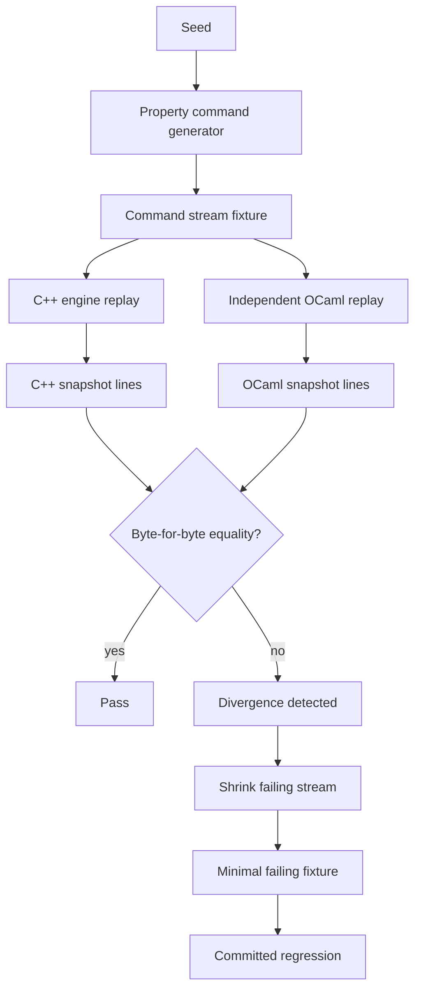

# Differential Testing Architecture

The C++ exchange engine is the **system under test**. An independent OCaml engine replays the
same command streams and must compute the **same** final snapshot; a property generator probes
the command space across seeds, and a shrinker reduces any disagreement to a minimal
counterexample. This is cross-language differential testing, **not** formal verification.



Pipeline by milestone: **M15** exports normalized command-stream + snapshot fixtures; **M16**
replays them independently in OCaml; **M17** asserts C++≡OCaml snapshot equality; **M18**
generates enriched seeded streams; **M19** shrinks failures to minimal fixtures. The sections
below document each layer; "what this proves / does not prove" is at the end.

## Producing a fixture

```bash
cmake --build --preset dev --target qsl-export-stream
./build/dev/qsl-export-stream [seed] [orders] > fixture.txt
```

The exporter drives the deterministic market-like synthetic flow (`generate_flow(seed)`) through
the risk gateway and is byte-for-byte reproducible for a given seed. The model has drifting
per-symbol mid-prices, mostly resting liquidity, active-order cancels/modifies, and occasional
market/crossing flow; it remains synthetic and is not real market data. A committed example lives
at `ocaml/test/fixtures/stream_seed7.txt`.

## Format (version 1)

Line-oriented, space-separated tokens, big-endian-agnostic plain text. Lines starting with `#`
are comments. Integers are decimal; a missing best price is `-`. Sides are `B`/`S`; TIF is
`GTC`/`IOC`.

```text
version 1
meta seed <s> symbols <n> orders <n> max_qty <q> max_notional <v>

# command stream (in submission order), each followed by its outcome lines
cmd reg <name>
cmd limit  <sym> <id> <B|S> <price> <qty> <GTC|IOC>
cmd market <sym> <id> <B|S> <qty>
cmd cancel <sym> <id>
cmd modify <sym> <id> <price> <qty>

# engine events emitted by the preceding command (sequence order)
evt accept <seq> <sym> <id>
evt cancel <seq> <sym> <id>
evt modify <seq> <sym> <id>
evt trade  <seq> <sym> <taker> <maker> <price> <qty>

# a gateway/risk rejection (never entered the engine event stream)
reject <new_limit|new_market|cancel|modify> <id> <reason>

# final state
snapshot last_seq <n> trades <n>
sym   <id> bid <price|-> ask <price|-> orders <n>
level <sym> <B|A> <price> <qty>
```

### Notes

- **Command stream** is the authoritative replay input: registration order plus every
  submitted command. The independent OCaml engine (M16) replays these and ignores the `evt`
  lines, computing its own events/snapshot.
- **`evt` / `reject` lines** are the C++ gateway/engine outcomes, included for cross-checking
  in M17. `evt` lines are sequenced engine events. `reject` lines are structured gateway/risk
  rejections scoped by command kind; rejected commands never enter the engine event stream and
  do not consume sequence numbers.
- Accepted commands may emit zero or more `evt` lines. Unknown-order no-ops may emit no event
  and no rejection, so M17 must not assume every command has an outcome line. Explicit `reject`
  lines are part of the C++ outcome stream and distinguish risk/gateway rejection from no-op
  commands.
- **Snapshot** is the full final per-symbol state: best bid/ask, per-price aggregate levels
  (`level` lines, best-first as the engine reports them), resting order counts, last sequence
  number, and trade count. Each `level` line carries its symbol explicitly; the OCaml parser
  validates that the level symbol matches the surrounding `sym` block. Malformed snapshot
  ownership is rejected rather than normalized away.

## Determinism and consistency (tested)

`tests/unit/test_fixture_export.cpp` asserts:

- the export is byte-identical for a fixed seed, and differs across seeds;
- every line matches the grammar above (record type + arity), including command-scoped
  rejection lines and parseable risk metadata;
- `snapshot last_seq` equals the maximum event sequence, and the reported trade count equals
  the number of `evt trade` lines;
- registered-but-empty symbols remain present in the snapshot with no `level` records;
- the flow is non-vacuous (real commands, trades, and rejections occur).

## Scope and limits

- This is a deterministic export + parseability contract, not a correctness proof and not
  formal verification.
- Independent OCaml replay (M16) and C++-vs-OCaml snapshot equality (M17) build on this schema.


## M17 — differential replay (C++ vs OCaml)

`ocaml/test/test_differential.ml` closes the loop: for each fixture it independently replays the
command stream in OCaml (`Replay_engine`), then compares the OCaml-computed snapshot against the
C++ snapshot embedded in the same fixture. Equality covers per-symbol best bid/ask, per-price
level aggregates, resting order counts, `last_seq`, and trade count (compared via the canonical
`snapshot_to_lines` rendering, so a mismatch prints a readable `computed` vs `expected` line).

Fixtures under test:

- `stream_seed7.txt` — the market-like synthetic flow (GTC/IOC limits, market, cancel, modify,
  rejects, 4 symbols);
- `stream_ioc.txt` — a hand-built scenario from `qsl-export-stream ioc` covering IOC discard
  (partial and no-cross), market, and partial-maker fills;
- `stream_bad_snapshot.txt` — a valid command stream with a deliberately corrupted snapshot
  section; the test asserts the mismatch **is** detected.
- `bad_snapshot_level_symbol.txt` — a deliberately malformed snapshot where a `level` record
  claims a different symbol than the surrounding `sym` block; the parser rejects it before
  comparison, so malformed per-symbol ownership cannot be normalized into equality.

The check runs under the existing `ocaml-verifier` CI job via `dune runtest` (no separate job).
It is differential testing against the C++ system under test, not formal verification.


## M18 — property-based command generator

`generate_property_flow(seed)` (C++) produces an enriched, seed-deterministic command stream
that deliberately exercises the full command space: valid limit/market orders, IOC, invalid
prices and quantities, duplicate active ids, reused inactive ids, unknown symbols, cancels and
modifies of active and inactive orders, and multi-symbol interleavings. `qsl-export-stream prop
<seed>` exports one fixture per seed; `prop_seed1..50.txt` are committed.

The committed fifty (`prop_seed1..50`) are the regression floor; the `differential-sweep` CI job
widens coverage per run by generating seeds `1..64` on the fly (`scripts/seed_sweep.sh`) —
exporting each with the C++ exporter and checking it against the independent OCaml replay via
`diff_report`. New seeds need no committed fixtures, and any divergence uploads the same failure
bundle.

`test_differential.ml` discovers every `prop_*.txt` fixture (via `Sys.readdir`) and runs the
same C++-vs-OCaml snapshot equality plus a no-crossed-book invariant on each, reporting the
failing fixture/seed on divergence. The two engines agree exactly across all committed seeds
(`prop_seed1..50`); seeds 1–8 alone already exercise every gateway/risk reject reason produced by
the property generator (UnknownSymbol, UnknownOrder, InvalidPrice, InvalidQuantity,
MaxQuantityExceeded, MaxNotionalExceeded, DuplicateOrderId) and real trades. `StorageExhausted`
belongs to the opt-in intrusive storage experiment, so it is not part of the baseline property
corpus. This reject-reason coverage is enforced by `test_reject_coverage` (it tallies the reasons
the generator produces and fails CI if any reachable reason stops occurring).

### Oracle hardening

- **Negative coverage:** three hand-corrupted fixtures (`stream_bad_snapshot`,
  `stream_bad_lastseq`, `stream_bad_orders`) corrupt distinct snapshot fields (an ask level,
  `last_seq`, and `order_count`); the test asserts each is detected, proving the comparison
  is not blind to those fields.
- **Mutation testing:** `test_mutation.ml` takes one representative snapshot and applies a
  single-field mutation for every field (last_seq, trade count, symbol id, best bid/ask, order
  count, bid
  and ask levels), asserting each changes `snapshot_to_lines` — so no field can silently drop
  out of the comparison. This covers every field programmatically, complementing the
  hand-authored negative fixtures above.
- **Golden regeneration:** `make check-fixtures` (`scripts/check_fixtures.sh`, run in the
  `build-test` CI job) regenerates every C++-produced fixture and diffs it against the
  committed copy, so the differential tests can never silently compare OCaml against a stale
  C++ snapshot. Hand-authored `stream_bad_*` fixtures are intentionally not regenerated.
- **Reproducibility manifest:** `make check-manifest` (`scripts/fixture_manifest.sh`, also in
  the `build-test` CI job) records the generator version (`replay::kGeneratorVersion`), the
  exporter invocation (seed/scenario), and the SHA-256 of each committed fixture in
  `ocaml/test/fixtures/MANIFEST.txt`. The check fails if a committed fixture changes without the
  manifest being regenerated. The recorded `generator_version` is human-set provenance:
  bumping it on a semantic generator change is a documented maintainer convention (the check
  cannot infer intent from bytes), not an automatically enforced invariant.

This is property-based differential testing against the C++ system under test — not formal
verification or a proof of correctness.


## M19 — shrinker + minimal failing fixtures

`replay::shrink(commands, predicate)` (C++) reduces a failing command stream to a small,
reviewable counterexample while preserving a failure predicate. It is greedy and deterministic,
iterating to a fixed point: remove contiguous chunks (decreasing size), remove single commands,
simplify fields (lower quantities and limit/modify prices), and renumber (drop unreferenced
symbol registrations and compact symbol/order ids). `qsl-export-stream shrink <seed>`
shrinks the property flow for a seed and writes the minimized differential fixture prefixed
with a shrink report (seed, original/minimized length, reduction %, shrink iterations, failure reason).

The committed `shrunk_seed1.txt` reduces a 123-command flow to **3** commands (one symbol
registration + a resting sell + a crossing IOC buy that trades), and the OCaml differential
test replays it independently.

### Limitations (honest)

- **Artificial predicate.** The real predicate would be "C++ and OCaml snapshots disagree", but
  the engines currently agree on every tested stream, so the demonstrated predicate is the
  artificial "produces a trade". The shrinker is predicate-agnostic; a divergence predicate
  plugs in unchanged.
- **Greedy, not globally minimal.** It finds a 1-minimal stream under removal, not the smallest
  possible counterexample.
- **Field simplification lowers quantities and limit/modify prices** (each toward 1, kept only
  where the predicate still holds); a renumber pass then drops registrations for unreferenced
  symbols and compacts symbol and order ids (bijective, so engine semantics are preserved).
- **Renumbering does not merge or reorder.** It compacts ids and drops unused registrations but
  does not coalesce distinct symbols/orders or reorder commands, so the result is still only
  1-minimal under removal, not globally minimal.
- This is shrinking for differential/property testing, not a proof of minimality or correctness.


## Minimized failing fixture (example)

`shrunk_seed1.txt` is a shrinker output (artificial "produces a trade" predicate) reduced from
a 123-command flow to 3 commands — the minimal stream that still trades:

```text
# shrink report
# seed: 1
# original length: 123
# minimized length: 3
# reduction: 97.5%
# shrink iterations: 2
cmd reg S0
cmd limit 0 0 S 1 1 GTC
cmd limit 0 1 B 1 1 IOC        # crosses -> 1 trade
snapshot last_seq 3 trades 1
```

(The renumber pass dropped the two unused registrations and renumbered the surviving symbol to 0
and the order ids to 0/1.)

## Divergence demonstration (issue #37)

The shrinker above is exercised against the artificial "produces a trade" predicate because the
C++ engine and the OCaml oracle agree on every tested stream — there is no real divergence to
reduce. To show the machinery on a genuine cross-language failure, we inject one: the OCaml
oracle gains a deliberately buggy mode, `replay_snapshot --drop-cancels`, that ignores cancels.

`qsl-export-stream divergence <seed>` then shrinks a property flow against the predicate "the
correct engine and a cancel-dropping oracle disagree", emitting a minimal fixture whose embedded
snapshot is the *correct* C++ result. `make divergence-demo` (`scripts/divergence_demo.sh`, run
in CI) replays that minimal fixture with both oracles and asserts the honest one agrees while the
buggy one diverges:

```text
cmd reg S0
cmd limit 0 0 B 1 1 GTC
cmd cancel 0 0
snapshot last_seq 2 trades 0      # correct C++; honest OCaml replay matches this
sym 0 bid - ask - orders 0
# replay_snapshot --drop-cancels diverges: last_seq 1, sym 0 bid 1 orders 1, level 0 B 1 1
```

So a 123-command flow shrinks to a 3-command counterexample that reproduces a real C++-vs-OCaml
snapshot mismatch — the shrinker working on an actual differential failure, not just the
artificial predicate. The bug is confined to the opt-in `--drop-cancels` flag; the normal
differential tests are unaffected.

This minimized counterexample is also kept in the differential regression archive
(`regressions/`), which preserves notable shrunk failures over time (currently only this
synthetic one, since the real engines agree).

## Coverage matrix

Each snapshot field crossed with the kind of differential coverage that exercises it. The
snapshot is rendered by `snapshot_to_lines`, so every field is compared on every *positive*
(`expect_match`) fixture; the table records which fields additionally have a *dedicated*
negative fixture, are driven by the generator, and are reduced by the shrinker.

| Snapshot field      | Positive | Negative (dedicated)            | Property + sweep | Shrink |
| ------------------- | :------: | ------------------------------- | :--------------: | :----: |
| `last_seq`          |    ✓     | `stream_bad_lastseq`            |        ✓         |   ✓    |
| `trades` (count)    |    ✓     | `stream_bad_trades`             |        ✓         |   ◻    |
| `sym` (id / order)  |    ✓     | `bad_snapshot_level_symbol` †   |        ✓         |   ◻    |
| `best_bid`          |    ✓     | `stream_bad_bestbid`            |        ✓         |   ✓    |
| `best_ask`          |    ✓     | `stream_bad_bestask`            |        ✓         |   ◻    |
| `order_count`       |    ✓     | `stream_bad_orders`             |        ✓         |   ✓    |
| `bid_levels`        |    ✓     | `stream_bad_bidlevel`           |        ✓         |   ✓    |
| `ask_levels`        |    ✓     | `stream_bad_snapshot` (ask qty) |        ✓         |   ◻    |

Legend: ✓ covered · ◻ not specifically exercised.

- **Positive** — `expect_match` on `stream_seed7`, `stream_ioc`, `shrunk_seed1`, `prop_seed1..50`;
  snapshot-line equality compares all fields, so every field is positively covered.
- **Negative** — a hand-corrupted fixture that perturbs exactly one field; the test asserts the
  divergence is detected (`expect_mismatch`), proving the comparison is not blind to that field.
- **Property + sweep** — the generator (`generate_property_flow`) and the `differential-sweep`
  CI job (seeds 1..64) populate all fields across randomized flows.
- **Shrink** — the shrinker is field-agnostic (it reduces any failing command stream); ✓ marks
  the fields that actually diverge in the demonstrated minimal counterexample from the oracle
  self-test (#34). That case shrinks to a registered symbol, a resting **bid** limit, and a
  cancel of it, so the cancel-dropping mutant differs only on `last_seq`, `best_bid`,
  `bid_levels`, and `order_count`; the ask side, `trades`, and `sym` are not exercised by it.
- † `sym` has no value-mismatch fixture; instead `bad_snapshot_level_symbol` is a parse-error
  guard asserting a level line cannot claim a symbol other than its `sym` block.

## What this proves / does not prove

**Proves:**

- The independent OCaml replay computes the same final snapshot as the C++ engine — best
  bid/ask, per-price level aggregates, resting order counts, `last_seq`, and trade count — over
  the synthetic seed, the IOC scenario, and the seeded property streams (every reject reason and
  real trades exercised), so the two implementations agree across the tested command space.
- The comparison genuinely detects divergence (negative fixtures corrupting an ask level,
  `last_seq`, and `order_count` are caught), and committed fixtures are golden-regenerated in CI
  so they cannot drift from current C++ output.

**Does not prove:**

- Not formal verification and not a proof of correctness: agreement is over the *tested* seeds
  and scenarios, not all inputs.
- Two engines could share the same wrong assumption; the OCaml engine is independently written
  to reduce that risk, but does not eliminate it (see the oracle-independence backlog item).
- The shrinker is demonstrated against an artificial predicate (the engines currently agree, so
  there is no real divergence to shrink); it is greedy and not globally minimal.
- Nothing here concerns production exchange behavior, latency, or trading profitability.


## Failure artifacts (CI)

When the differential check fails in CI, the `ocaml-verifier` job runs `diff_report` over the
positive fixtures and uploads a `differential-failure-bundle` artifact. For each diverging
fixture it contains `<base>.original` (the fixture), `<base>.computed` (OCaml snapshot),
`<base>.expected` (C++ snapshot), and `<base>.diff` (a line diff) — so a divergence can be
debugged from the CI run without reproducing locally. `diff_report` guards each fixture
independently: a malformed or unreadable fixture is reported as a comparison failure (non-zero
exit), not allowed to abort the batch and lose the remaining fixtures' bundles (#144). The
minimal-counterexample form of a
failing *generated* stream is produced separately by the C++ shrinker (`qsl-export-stream
shrink`, M19).
