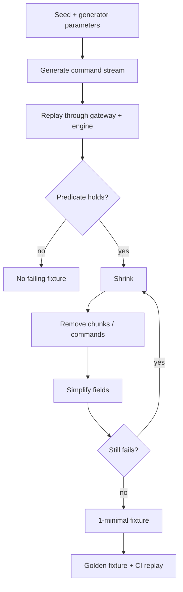

# Property-Based Generation and Shrinking

The property layer probes the C++ engine with seeded, deterministic command streams and feeds
each through the differential oracle (`docs/differential_testing.md`). When a stream "fails" a
predicate, the shrinker reduces it to a minimal counterexample.

## Generator (`generate_property_flow(seed, symbols, orders)`)

Deterministic by seed (`std::mt19937_64`, integer-only), so fixtures are byte-reproducible and
golden-checked in CI. It deliberately spans the command space rather than only valid orders:

- valid limit and market orders; GTC and IOC;
- invalid prices (0) and quantities (0, and large values exceeding `max_qty`);
- duplicate active ids and reused inactive ids;
- unknown symbols; cancels and modifies of active and inactive orders;
- multi-symbol interleavings.

Committed fixtures `prop_seed1..50.txt` exercise every reject reason (UnknownSymbol, UnknownOrder,
InvalidPrice, InvalidQuantity, MaxQuantityExceeded, MaxNotionalExceeded, DuplicateOrderId) plus
real trades; the C++ and OCaml snapshots agree on all of them.

## Shrinker (`replay::shrink(commands, predicate)`)

Greedy, deterministic delta-debugging that preserves a pluggable failure predicate:

1. remove contiguous chunks (decreasing size);
2. remove single commands;
3. simplify fields (lower quantities and limit/modify prices);
4. renumber (drop unreferenced symbol registrations, compact symbol/order ids);

iterated to a fixed point. The result is 1-minimal under single-command removal. The fixture
exporter (`qsl-export-stream shrink <seed>`) writes the minimized stream plus a report (seed,
original/minimized length, reduction %, shrink iterations, failure reason); see `shrunk_seed1.txt` (123 → 3 commands).

## Determinism and reproducibility

- Generation is seeded and integer-only; the CI golden check (`make check-fixtures`) regenerates
  the committed fixtures and diffs them against current C++ output, so they cannot silently drift.
- Both engines are wall-clock independent, so replay and comparison are reproducible.
- An explicit cross-compiler determinism check (`make determinism`, in the `determinism` CI job)
  builds the exporter with both gcc and clang and asserts every generated fixture is byte-identical
  between them and to the committed copies (produced on macOS/AppleClang) — covering compiler and
  platform reproducibility, not just same-toolchain regeneration.

## Honest limits

- The shrinker is demonstrated against an artificial "produces a trade" predicate, since the
  engines currently agree (no real divergence to shrink); it is predicate-agnostic.
- Greedy, not globally minimal; field simplification covers quantities and prices; a renumber pass compacts symbol/order ids and drops unused registrations.
- Coverage is over the committed seeds; a dynamic CI seed sweep is tracked in the backlog.
- This is property-based differential testing, not formal verification or a correctness proof.
