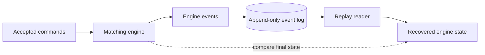

# Replay and Recovery



## Append-only event log (M7)

Accepted commands and emitted engine events are persisted as framed records in an
append-only log (`include/qsl/replay/event_log.hpp`, `src/replay/event_log.cpp`). The
writer opens the file in binary append mode and only ever appends — it never seeks back or
rewrites existing records.

### Record format

All integers are big-endian (reusing the M2 protocol byte helpers). A record is a fixed
**22-byte header**, then the payload, then a trailing checksum:

| Offset      | Size   | Field               | Type  | Notes                              |
| ----------: | -----: | ------------------- | ----- | ---------------------------------- |
|           0 |      8 | `seq_no`            | u64   | record sequence number             |
|           8 |      2 | `record_type`       | u16   | `CommandRecord` (1) or `EventRecord` (2) |
|          10 |      8 | `logical_timestamp` | u64   | deterministic logical time         |
|          18 |      4 | `size`              | u32   | payload byte count                 |
|          22 | `size` | `payload`           | bytes | serialized command/event           |
| 22 + `size` |      4 | `checksum`          | u32   | FNV-1a over the header + payload   |

- `record_type`: `CommandRecord` (1) or `EventRecord` (2).
- `payload`: the message's serialized bytes, opaque to the log (e.g. a binary-protocol
  command frame). Capped at `kMaxPayload` (1 MiB). The writer rejects records above this
  cap before writing, so a successful append remains readable by this implementation.
- `checksum`: FNV-1a 32-bit over the record's header + payload bytes.

### Reading and failure handling

`read_log(bytes)` decodes records sequentially and never reads out of bounds. It stops at
the first corrupt or truncated record and returns the records read so far plus a
deterministic `LogError`:

| Error             | Condition                                                  |
|-------------------|------------------------------------------------------------|
| `OpenFailed`      | the requested log file cannot be opened or read            |
| `Truncated`       | the buffer ends before a full header, payload, or checksum |
| `BadChecksum`     | the stored checksum does not match the record's bytes      |
| `PayloadTooLarge` | the declared payload size exceeds `kMaxPayload`            |

A buffer that ends exactly on a record boundary reads cleanly (`LogError::None`); a
truncated trailing record is reported as `Truncated` while earlier intact records are still
returned.

`EventLogWriter::append` checks both `fwrite` and `fflush` before reporting success in the
default `FlushOnAppend` mode; the M7 guarantee is stdio flush correctness for the append
path, not durable-to-disk semantics. M45 added explicit durability modes (`BufferedOnly`,
`FlushOnAppend`, `FsyncOnAppend`, plus a `sync()` group-commit point), torn-tail recovery
classification (`recover_log`, `qsl-replay recover`), conservative tail repair, and a
SIGKILL crash-validation harness (`make crash-recovery`). The persistence failure model and
its limits are documented in [persistence.md](persistence.md).

`EventLogReader::read_all` distinguishes a missing or unreadable file from a valid empty
log: open/read failures return `LogError::OpenFailed`, while an existing empty file reads
cleanly as zero records.

`apps/qsl-loginspect` is a small CLI that prints a human-readable summary of a log file
(record count, sequence range, command/event counts, and status).

## Deterministic replay and recovery (M8)

The log is a stream of `Command` records (`include/qsl/replay/command.hpp`). The recordable
command set is `RegisterSymbol`, `NewLimit`, `NewMarket`, `Cancel`, `Modify` — a
`std::variant` serialized with a 1-byte tag plus fixed-width fields (`RegisterSymbol`
carries a variable-length name). Including `RegisterSymbol` makes a log **self-contained**:
registering the same names in the same order reproduces identical `SymbolId`s, so the
commands' numeric symbol references line up on replay.

`replay(engine, records)` (`replay/recovery.hpp`) rebuilds state by decoding each command
record and applying it to a fresh engine in order; non-command records and undecodable
payloads are skipped. Because the engine is deterministic and wall-clock independent,
applying the same command stream reproduces the same state and the same emitted events.

### Replay invariant

```text
fresh engine + replay(log) == original engine final state
```

### Comparison dimensions

`EngineSnapshot` (compared with a defaulted `==`) covers, per symbol ordered by `SymbolId`:

- best bid / best ask,
- resting order count,
- **aggregate quantity at each price level** (`bids`/`asks` as `LevelView{price, quantity}`,
  best price first),

plus the engine's **last sequence number**. The **emitted trade/event sequence** is compared
separately by replaying and checking the event stream equals the original. The
replay-equivalence test drives a deterministic market-like synthetic flow (fixed RNG seed,
`generate_flow`) of limit/market/cancel/modify commands across several symbols, then asserts both
the final snapshot and the full event sequence match. The generator is still synthetic: it uses
drifting per-symbol mid-prices, mostly resting liquidity, active-order cancels/modifies, and
occasional market/crossing flow. It is not real market data.

### Recovery CLI

```text
qsl-replay generate <file> [seed]   # write a deterministic synthetic-flow command log
qsl-replay <file>                   # rebuild engine state from the log and print it
```

Generation checks every `EventLogWriter::append` result and exits nonzero on write or
flush failure instead of reporting a complete generated log. Replay exits nonzero when the
requested log cannot be opened or read; `records: 0` is only reported for a real log that
was opened and decoded cleanly as empty. M8 tests include a file-level
`EventLogWriter -> EventLogReader -> replay` round trip through the M7 byte framing.

## Recovery cost (M46)

Recovery in this repo is **full replay**: a restarting process re-reads the entire log and
re-applies every command, so restart time grows with history length, not with live state.
`make bench-recovery` (`qsl-bench recovery`, artifact
`results/recovery_benchmarks.txt`) measures that cost on the generating host.

**Recovery objective measured.** Restart cost — the wall time from a clean log file to a
rebuilt engine (RTO-style), split into its two phases:

1. `recover_log_file`: read the file and verify/classify every frame (the M45 crash-safe
   entry point);
2. `replay`: decode and apply every command into a fresh engine;

plus the combined end-to-end restart, at several log lengths to expose the linear growth.
How much acknowledged data can be **lost** before restart (RPO-style) is a property of the
M45 durability modes and is exercised by `make crash-recovery`, not by this benchmark.

**Snapshot-restoration prototype.** To quantify what snapshot-bounded recovery would buy,
the benchmark also measures rebuilding the book directly from captured live state:
`MatchingEngine::resting_orders` enumerates every resting order in priority order (bids
best-first, then asks, FIFO within a level), and re-adding that sequence into a fresh
engine reproduces levels and intra-level time priority exactly — verified against the
reference snapshot on every run, including a synthetic-depth sweep because the realistic
flow leaves only a few dozen resting orders (per-order timings on such small books are
noisy; the controlled-depth section is the reliable scaling signal). This prototype is
**benchmark-only and in-memory**: no snapshot file format or persistence path exists, the
numbers exclude serialization, disk I/O, and tail replay past the snapshot point, and the
restored engine's sequence counter is rebuilt by re-counting accepts, so a real snapshot
design would also have to persist sequencing state.

**What the artifact supports.** On the measured host, full-replay restart cost is linear
in log length while book rebuild cost is linear in resting-order count; for the measured
synthetic flows the live state is orders of magnitude smaller than the history that
produced it. That is the case for snapshot-bounded recovery *if* restart time ever
matters — and no more: the numbers are single-machine, warm-cache, synthetic-flow
measurements, not a production recovery-time claim.

### Limitations

- Replay reconstructs from the recorded **command** stream; emitted events are recomputed,
  not read back from the log (the log could also store events, but the engine is the source
  of truth for replay equivalence).
- The reader loads the whole log into memory before replaying (adequate for the simulator).
- Commands are trusted once their record checksum validates (M7); the command codec does not
  re-validate enum domains — wire-level enum validation lives at the protocol boundary (M2)
  and risk checks at the gateway (M5).
