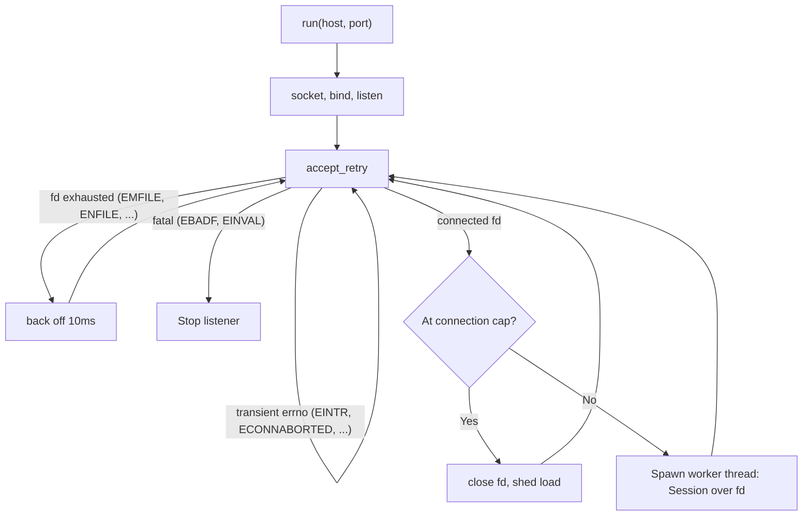

# Socket Gateway

The TCP order gateway exposes the in-process `OrderGateway` (M5) over a stream socket using
the M2 binary protocol. It is split into two pieces:

- **`Session`** (`include/qsl/gateway/session.hpp`), a *pure* byte processor with no socket
  calls. It buffers inbound bytes, frames whole messages, drives the `OrderGateway`, and
  returns response bytes. This is where all protocol logic lives, so it is fully unit-tested
  deterministically.
- **`TcpServer`** (`include/qsl/gateway/tcp_server.hpp`), a thin POSIX-socket transport:
  `serve_connection(fd)` runs a `Session` over one connected socket; `run(host, port)` binds,
  listens, accepts connections, and serves each accepted connection on a worker thread while
  serializing gateway mutation.
- **`EpollServer`** (`include/qsl/gateway/epoll_server.hpp`), a Linux-only event-driven
  transport prototype: one `epoll` loop accepts multiple clients and drives one `Session` per
  connection with nonblocking reads and writes.

The threaded `TcpServer` accept loop tolerates transient and resource-exhaustion errors instead of
tearing the listener down, and sheds load at the connection cap:



## Message flow

```text
client -> NewOrder/CancelOrder/Heartbeat -> Session -> OrderGateway -> MatchingEngine
client <- Ack / Reject / Fill / HeartbeatAck <- Session
```

- A new order is acknowledged with `Ack` (carrying the accepted sequence number), followed by
  a `Fill` per trade.
- A risk-rejected (but well-formed) order returns a `Reject` with a `RejectReason`; the
  connection stays open.
- A `Heartbeat` is answered with a `HeartbeatAck` echoing the client's token.

## Frame boundaries and partial reads/writes

The wire is a byte stream, not a message stream. `Session` accumulates bytes in a buffer and
only processes a frame once the 16-byte header plus the declared `body_len` are present; a
frame split across multiple `read()`s is held until complete.

The portable `TcpServer` writes responses with a send-all loop that tolerates partial writes.
The Linux `EpollServer` keeps a per-client outbound buffer and leaves the connection registered
for `EPOLLOUT` until all pending response bytes are accepted by the kernel. Both write paths use
`send(..., MSG_NOSIGNAL)` where available, and the platform socket option where available, so a
client that drops before reading a response cannot terminate the gateway through `SIGPIPE`. Both the
read and write paths retry on `EINTR`, a signal interruption is treated as retryable, not a
disconnect.

The epoll path treats `EAGAIN` / `EWOULDBLOCK` as normal nonblocking backpressure:

- `accept4(..., SOCK_NONBLOCK)` loops until the listening socket would block.
- client reads loop until the connection would block, reaches EOF, errors, or the `Session`
  flags a malformed stream for disconnect.
- client writes loop until the outbound buffer is empty or `send()` would block.
- a peer that half-closes after sending requests can still receive queued responses; the
  connection closes after the pending outbound buffer drains.
- if Linux reports `EPOLLIN` together with `EPOLLHUP`, the epoll path drains the already-readable
  bytes before honoring the hangup; `EPOLLERR` remains an immediate close.
- once a session is closing after malformed input or an over-cap frame with queued replies,
  `EPOLLIN` is not re-armed; the connection is write-only until its pending output drains.
- client readiness events carry a per-connection generation token, so stale events in the same
  `epoll_wait` batch cannot act on a newer connection that reused the same numeric fd.

A client that keeps sending requests but stops reading its responses cannot grow the gateway's
memory without bound. Each connection's outbound buffer has a high-water mark
(`EpollServerOptions::max_outbuf_bytes`, default 1 MiB): once the backlog reaches it the server
stops reading from that client (drops `EPOLLIN`, keeping only `EPOLLOUT`), so unread requests back
up in the kernel receive buffer and TCP flow control pushes back on the sender. Reads resume once
the backlog drains below the mark.

That soft mark bounds how many *further* requests a non-reading peer induces, but a single
request's response can fan out, a market order sweeping a deep book returns one fill per resting
maker. So a **hard cap** (`EpollServerOptions::max_outbuf_hard_bytes`, default 8 MiB) is the
absolute ceiling. The epoll path asks `Session` to append responses directly into the per-client
buffer under that byte budget; before a `NewOrder` reaches the gateway, the session previews the
accepted/rejected outcome and exact fill count against current engine state. If the full response
would exceed the cap, the connection is dropped without appending a partial response and without
mutating engine state. If the same read already queued valid replies for earlier accepted frames,
those replies are flushed and reads are disabled before close. A client that reads its responses
keeps the backlog near zero and trips neither threshold; only a peer that stops reading and then
induces an over-cap response is disconnected.

## Malformed frames

- A frame with a valid header but an undecodable body, or an unexpected message type, flags
  the session for disconnect (the server drops the peer) rather than risk stream desync.
- A header that fails to decode (bad version, unknown type, oversized body) cannot be reframed
  safely, so the session is likewise flagged for disconnect.
- In all cases the server does not crash; it simply stops serving the misbehaving peer.

## Disconnect and heartbeat

- Graceful disconnect: when the peer closes its write side, `read()` returns 0 (EOF) and the
  server finishes serving and closes the connection; a complete request delivered before a hangup
  is still drained before the connection is removed.
- Heartbeats are a liveness round-trip only; the gateway does not yet time out idle peers.

## Gateway transport modes

The default demo uses `TcpServer` because it is portable and easiest to inspect. The accept loop
spawns one worker per accepted connection, so a slow or still-open client no longer prevents the
server from accepting a later client. A connection cap (`TcpServerOptions::max_active_connections`,
default `0` = unbounded) load-sheds, a freshly accepted connection at the cap is closed immediately
rather than spawning another worker. The accept loop also survives transient `accept()` errors
(`EINTR`/`ECONNABORTED`, retried) and file-descriptor exhaustion (`EMFILE`/`ENFILE`, a brief back-off
retry) instead of tearing the listener down; the `EpollServer` handles the same conditions by
disarming and re-arming the listener. The shared `OrderGateway` remains protected by an internal
mutex; network I/O can overlap across clients, but matching-engine mutation stays serialized and
deterministic.

On Linux, `qsl-gateway` can run the epoll prototype explicitly:

```bash
./build/dev/qsl-gateway 9009 --epoll   # explicit port
./build/dev/qsl-gateway --epoll        # default port 9009; the flag may precede or replace the port
```

This mode is single-threaded and event-driven: it does not create one thread per connection.
Each connected client owns its own `Session`, so deterministic framing, malformed-frame handling,
risk checks, and response encoding are shared with the portable transport. M34 tests the real
loopback socket path with two simultaneous clients (and a backpressure case under a small
high-water mark) and verifies every client receives correct, in-order responses through one event
loop.

This is architecture validation, not a production-capacity claim. Multi-client load, socket
pressure, connection scaling, and throughput measurements are covered by the constrained M35
artifacts.

## Why it is still intentionally simple

The portable path uses worker threads for connection I/O, but it deliberately keeps gateway/engine
mutation serialized. The epoll path is single-threaded and multiplexes readiness across multiple
clients. There is still no TLS, no authentication, no rate limiting, no multi-core matching engine,
and no real venue connectivity.

## Security

There is **no authentication or authorization**. The server binds to **`127.0.0.1` only**, so
it is reachable only from the local machine in the default demo. M9 accepts numeric IPv4 bind
hosts only; invalid hosts such as `"localhost"` or typos fail startup and must not fall back
to `0.0.0.0`. Do not expose it on a routable interface or an untrusted network, it accepts
and acts on any order from any local connection. This is a local simulator, not a real venue.

## Local demo

In one terminal, start the gateway (default port 9009):

```bash
make build
./build/dev/qsl-gateway 9009
```

In another terminal, run the client (sends a `NewOrder` and a `Heartbeat`, prints replies):

```bash
./build/dev/qsl-client 9009
# responses:
#   Ack order=1 seq=1
#   HeartbeatAck token=42
```
